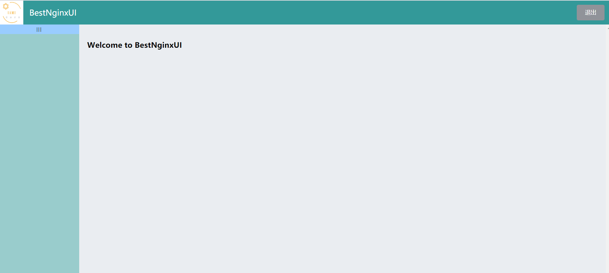
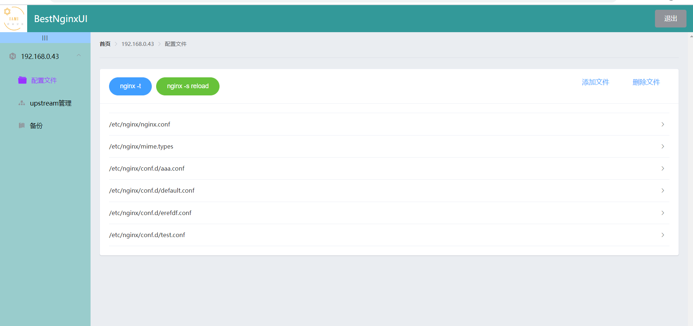
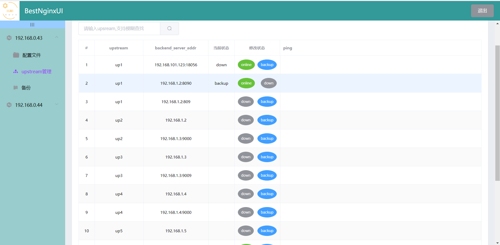

# BestNginxUI
##QQ交流群：517643670

## 项目简介

我认为这是一个更加贴合运维人员思维和操作习惯的nginx配置文件web管理平台。

- 与nginx解耦，只对配置文件进行CURD
- 采用C/S架构，客户端启动，就会把配置文件推到服务端
- 以文件为颗粒度进行配置文件的修改
- 对upstream的管理非常方便，一键操作upstream中server的状态
- 可以同时管理多个nginx

## 环境依赖

- python3.6+

## 部署步骤

此项目后端用fastapi开发，前端用vue3.6.3开发。先部署server端，再部署client端。

### 1、server端部署

- cd到server目录下，运行以下命令

  ```shell
  pip3 install  -r  requirements.txt
  ```

- 修改conf/conf_server.ini配置文件

  修改ip，端口不冲突则无需修改。

  ~~~ini
  [uvicorn]
  vicorn服务端启ip和端口
  ip = 192.168.0.45
  port = 18000 
  
  [client]
  ;此处无需配置，客户端启动后会发送其ip、port到服务端，然后保存到这里。
  ~~~

- 修改dist/static/config.js 配置文件，跟上面的ip和端口一致

  ~~~js
  window.Glob = {
      BaseUrl: 'http://192.168.0.45:18000'
  }
  ~~~

  

- 启动服务：

  ```shell
  python3 server.py &
  ```

- 前端页面用vue开发，需要用nginx运行，需要先下载nginx，然后配置网页根目录为dist目录

  ~~~nginx
  server {
      listen 80;
      server_name localhost;
      location / {
          root 这里为dist目录绝对路径;  #配置网页根目录
          index index.html index.htm;
      }
      error_page 500 502 503 504 /50x.html;
      location = /50x.html {
          root /usr/share/nginx/html;
      }
  }
  ~~~

- 

- 访问 http://ip ，

- 用户名：admin，密码：admin，至此服务端部署完成

  

  

  此时没有任何数据，等客户端启动成功后，就会看到数据。

### 2、client端部署

- client端，要跟需要被管理的nginx，部署在同一台机器上。

- cd到client目录下，运行以下命令

  ~~~shell
  pip3 install -r  requirements.txt
  ~~~

- 修改配置文件:

  ~~~ini
  [server]
  ;服务端的ip和端口
  ip=192.168.0.45
  port=18000
  
  [nginx]
  ;本机nginx的ip
  nginx_ip=192.168.0.43
  
  ;nginx主配置文件绝对路径
  nginx_main_conf_path=/etc/nginx/nginx.conf
  
  [uvicorn]
  ;uvicorn服务启动参数
  ip=0.0.0.0
  port=18000
  ~~~

- 启动服务：

  ~~~shell
  python3 clinet.py &
  ~~~

- 客户端启动后会把配置推送到服务端，刷新页面即可看到nginx的所有配置文件

- 配置文件管理页如下：

  

- upsream管理也如下：
  
